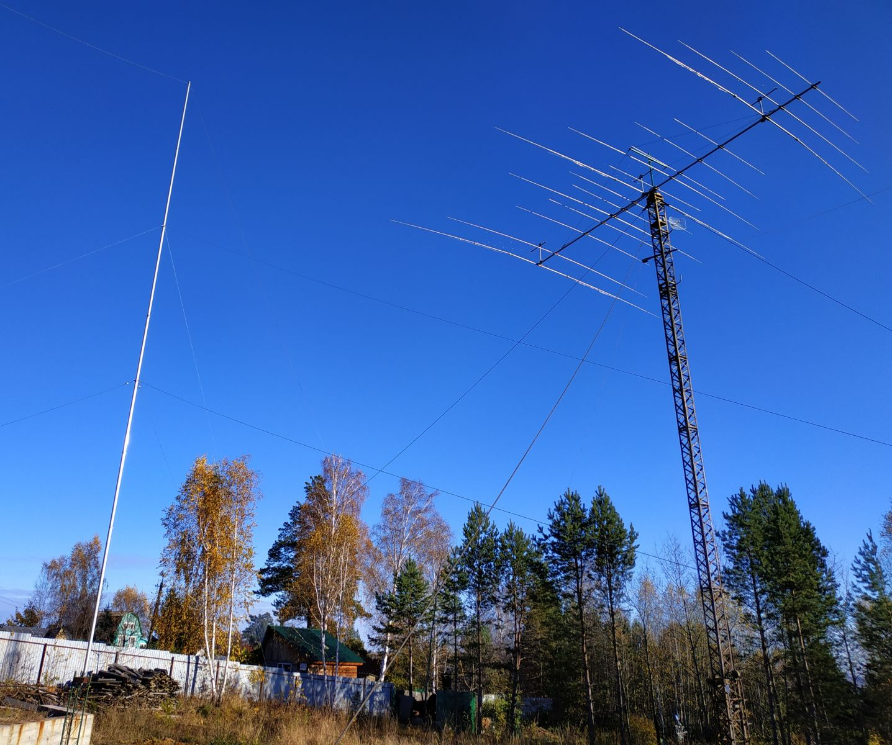
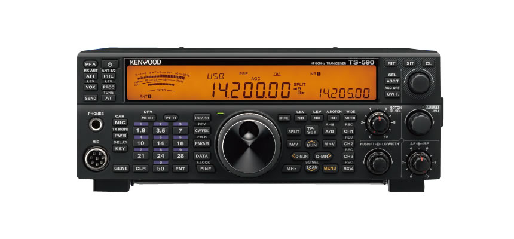

# Remote hamradio station

> A DX station always appears on the air precisely when you're away from your radio. 
> — Murphy's Law

## Why do you need remote

Having access to your amateur radio station from anywhere in the world with an Internet connection is incredibly convenient. There's really no arguing with that. Yet, from my experience talking with fellow hams, I've noticed that many people see remote station operation as something extremely complicated and difficult to understand. In this article, I'll break everything down step by step and show that setting up a remote station is much simpler than it may seem.

## Antenna and Equipment Installation Site

Every station is different, but the basic requirements are dictated by the goal. Ideally, the station should be located outside the city while still having a reliable Internet connection. At a minimum, you need stable 4G coverage, although the best option is a fiber-optic connection brought directly into the shack. Since the whole point is to operate the station remotely, the location should also be as radio-quiet as possible, with minimal RF interference across the amateur bands.

## Transceiver

The transceiver must support CAT control; otherwise, remote operation simply won't be possible. It's also highly desirable to have PC software that provides full access to the transceiver's menus. For example, the Kenwood TS-590 is supported by [ARCP-590](https://www.kenwood.com/i/products/info/amateur/ts_590/arcp590_e.html), which allows complete configuration from a computer. Or you can write your own software to control the transceiver [I chose this option](https://github.com/ra0sms/TS590_CAT_Control).

Another useful feature is the ability to power the transceiver on and off via CAT commands. Ideally, a transceiver intended for remote operation should have two independent CAT interfaces (RS-232 and USB) that can operate simultaneously. In my opinion, the Kenwood TS-590 (S/SG) is one of the best transceivers for remote station use because it meets all of these requirements. I'll explain the advantage of having two CAT interfaces later in the article.

## Computer

No matter how you look at it, the computer is the heart of a remote amateur radio station. It should be reliable and powerful enough to handle all required tasks, especially considering the rapid growth and widespread use of digital modes such as FT8.

